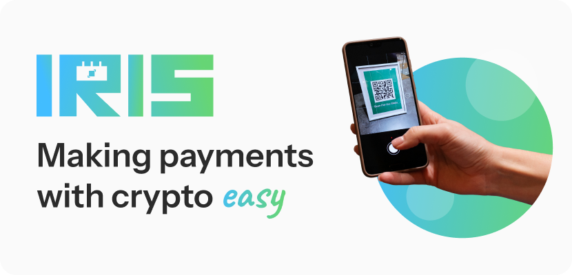

# IRIS 👁️


## Project Introduction

<p align="justify"><b>IRIS</b> (Instant Reliable Interchain Settlement) is a decentralized crypto payment solution inspired by Indonesia's QRIS system, designed to bring the same level of accessibility, simplicity, and standardization to the world of cryptocurrency. With <b>IRIS</b>, users can scan a single QR code to pay with various cryptocurrencies, starting with Bitcoin and ICP, while merchants receive payments seamlessly, even if they don't have a crypto wallet. For merchants without a wallet, <b>IRIS</b> automatically provisions a secure virtual wallet on the Internet Computer (ICP) network. <b>IRIS</b> also supports real-time fiat-to-crypto conversion, enabling users to pay in one currency and merchants to receive in another. With plans to support cross-chain assets and integrate decentralized exchanges for live conversion rates, <b>IRIS</b> aims to make crypto truly usable for everyday transactions. Just as QRIS empowered millions of merchants across Indonesia, IRIS envisions a world where crypto becomes a practical, trusted, and everyday method of payment, starting one scan at a time.</p>

**Our Mission:** To create a universal, fast, low-cost, and inclusive payment system by bridging the Bitcoin ecosystem with national QR payment infrastructure.

**Key Features:**
* **QR-Based Crypto Payment** - Universal QR codes for seamless crypto transactions
* **Fiat-to-Crypto Conversion & Cashout** - Real-time conversion between Bitcoin and fiat currencies
* **Virtual Wallet Provisioning** - Automatic wallet creation for merchants without crypto wallets
* **Built on ICP for Speed & Privacy** - Leveraging Internet Computer's fast and secure infrastructure
* **Multi-Currency & Multi-Chain Support** - Support for various cryptocurrencies and cross-chain assets

**Why IRIS?**
QRIS changed how Indonesians pay, but only in fiat. Crypto payments are still fragmented, hard to use, and risky for merchants. IRIS solves that by combining the trust and usability of QRIS with the freedom and decentralization of Web3.

## Architecture Description

IRIS follows a **monolithic architecture** built on the DFINITY Internet Computer platform, developed using **DFX**, **Rust** for the backend, and **React** for the frontend. The frontend is mainly built with **TypeScript**, though some configurations like Webpack are still JavaScript-based. Authentication is handled via **Internet Identity**, and for now, the app is deployed locally using the DFINITY framework. We also use .did files to define canister interfaces.

### Backend Architecture

On the backend side, the codebase is structured into **models**, **services** that contain business logic, and **API** modules for route definitions. Data handling is currently set up using **in-memory, per-thread stores**, which are suitable for local development. The backend also includes pagination support through types.rs, which we plan to extend in later iterations.

**Backend Structure:**
```
src/iris_backend/
├── src/
│   ├── api/             # Route definitions and API endpoints
│   ├── models/          # Data models (Bitcoin, Invoice, Merchant, Payment, QR, User)
│   ├── services/        # Business logic layer
│   ├── storage/         # Data storage and persistence layer
│   ├── utils/           # Utility functions and helpers
│   ├── lib.rs           # Main library file
│   └── types.rs         # Type definitions and pagination
```

**Key Backend Components:**
- **Invoice API** - Handle transaction invoices and QR generation
- **Merchant API** - Merchant registration and business management services
- **Payment API** - Payment processing and status tracking
- **User API** - User registration and profile management
- **Models** - Data structures defining Bitcoin, Invoice, Merchant, Payment, QR, and User entities to serve as the skeleton or guideline for data handling

### Frontend Architecture

On the frontend, the structure resembles a typical React project, but with an additional **services folder** that manages data fetching from the backend. This enables separation of concerns and reuse of logic across components.

**Frontend Structure:**
```
src/iris_frontend/
├── src/
│   ├── components/      # Reusable UI components
│   ├── declarations/    # Auto-generated canister declarations
│   ├── lib/             # Shared libraries and utilities
│   ├── pages/           # Application pages and routes
│   ├── services/        # Data fetching and API communication
│   ├── types/           # TypeScript type definitions
│   ├── App.tsx          # Main application component
│   ├── index.css        # Global styles
│   ├── index.html       # HTML template
│   ├── index.tsx        # Application entry point
│   └── layout.tsx       # Main layout component
```

### Future Architecture Plans

Looking ahead, we plan to add a **datasource layer structure** to fetch data from external APIs—particularly for integrating with **crypto wallets** in a developer environment. Our goal is to support **real-time conversion between Bitcoin, other cryptocurrencies, and fiat currencies**.

## Build and Deployment Instructions for Local Development

To get started with IRIS development, you might want to explore the project directory structure and the default configuration file. Working with this project in your development environment will not affect any production deployment or identity tokens.

### Prerequisites
- [DFX](https://internetcomputer.org/docs/current/developer-docs/setup/install) (DFINITY Canister SDK)
- [Node.js](https://nodejs.org/) (v16 or higher)
- [Rust](https://rustup.rs/) (latest stable version)

### Quick Start

If you want to start working on your project right away, you might want to try the following commands:

```bash
cd iris/
dfx help
dfx canister --help
```

### Running the Project Locally

If you want to test your project locally, you can use the following commands:

```bash
# Starts the replica, running in the background
dfx start --background

# Deploys your canisters to the replica and generates your candid interface
dfx deploy
```

Once the job completes, your application will be available at `http://localhost:4943?canisterId={asset_canister_id}`.

If you have made changes to your backend canister, you can generate a new candid interface with:

```bash
npm run generate
```

This is recommended before starting the frontend development server, and will be run automatically any time you run `dfx deploy`.

If you are making frontend changes, you can start a development server with:

```bash
npm start
```

Which will start a server at `http://localhost:8080`, proxying API requests to the replica at port 4943.

### Note on Frontend Environment Variables

If you are hosting frontend code somewhere without using DFX, you may need to make one of the following adjustments to ensure your project does not fetch the root key in production:

- Set `DFX_NETWORK` to `ic` if you are using Webpack
- Use your own preferred method to replace `process.env.DFX_NETWORK` in the autogenerated declarations
- Setting `canisters -> {asset_canister_id} -> declarations -> env_override to a string` in `dfx.json` will replace `process.env.DFX_NETWORK` with the string in the autogenerated declarations
- Write your own `createActor` constructor

## Mainnet Canister ID(s)

*Coming Soon* - Currently deployed locally for development and testing.

## ICP Features Used

### Core ICP Technologies Currently Implemented
- **Internet Identity** - Secure, anonymous authentication system for seamless user onboarding
- **Candid Interface** - Type-safe communication between frontend and backend canisters
- **Rust CDK** - Internet Computer Canister Development Kit for robust backend development
- **Local Replica** - DFINITY local development environment for testing and iteration

### Advanced ICP Features (Planned Implementation)
- **Cross-Chain Integration** - Leveraging ICP's multi-chain capabilities for Bitcoin and other cryptocurrency support
- **Inter-Canister Communication** - Modular architecture with specialized canisters for different services

## Challenges Faced During the Hackathon

### Technical Challenges
1. **Authentication Integration** - Implementing Internet Identity seamlessly across the application while maintaining user experience
2. **State Management** - Coordinating real-time payment status updates between frontend and backend systems
3. **QR Code Generation** - Creating dynamic QR codes with embedded payment information that work across different devices
4. **Fiat Conversion Logic** - Implementing accurate and real-time currency conversion rates for multiple fiat currencies
5. **Multi-Identity Testing** - Managing different user roles (merchant/customer) in local development environment

### Design Challenges
1. **QRIS-like UX** - Adapting familiar payment flows to cryptocurrency transactions while maintaining simplicity
2. **Cross-Cultural Design** - Creating interfaces that work for both crypto-native and traditional users
3. **Mobile Responsiveness** - Ensuring QR scanning and payment flows work effectively across various devices

### Development Process Challenges
1. **Monolithic vs Microservices** - Balancing development simplicity with future scalability requirements
2. **Local Development Setup** - Streamlining the DFX development workflow for team collaboration
3. **Testing Strategy** - Creating comprehensive test scenarios for complex payment workflows
4. **Documentation** - Maintaining clear documentation for intricate payment processes and API interactions

## Future Plans (If Continuing Post-Hackathon)

### Short-term Goals (3-6 months)
- **Mainnet Deployment** - Deploy IRIS to Internet Computer mainnet with production-ready infrastructure
- **Mobile App Development** - Native mobile applications for iOS and Android with QR scanning capabilities
- **Enhanced Security Audit** - Comprehensive security review and smart contract auditing
- **Indonesia Market Pilot** - Launch pilot program with select merchants in major Indonesian cities
- **Payment Gateway Integration** - Connect with traditional payment processors for seamless fiat on/off ramps

### Medium-term Goals (6-12 months)
- **Multi-Chain Expansion** - Support for Ethereum, ICP tokens, and other major cryptocurrencies
- **Advanced Merchant Analytics** - Comprehensive dashboard with sales reporting, customer insights, and financial tools
- **Developer API Platform** - Public API for third-party integrations and custom merchant implementations
- **Regulatory Compliance** - Full compliance with Indonesian financial regulations and licensing requirements
- **Strategic Partnerships** - Collaborate with existing QRIS providers and major payment processors

### Long-term Vision (1-2 years)
- **Southeast Asia Market Expansion** - Launch operations in Malaysia, Thailand, Singapore, and Philippines
- **DeFi Protocol Integration** - Connect with decentralized finance ecosystems for yield generation and liquidity provision
- **Digital Asset Marketplace** - Support for NFT transactions, digital collectibles, and tokenized assets
- **Global Payment Network** - International expansion beyond Southeast Asia to other emerging markets
- **Open Source Development** - Release core components as open-source for community-driven innovation

---

**Learn More About Internet Computer Development:**

- [Quick Start](https://internetcomputer.org/docs/current/developer-docs/setup/deploy-locally)
- [SDK Developer Tools](https://internetcomputer.org/docs/current/developer-docs/setup/install)
- [Rust Canister Development Guide](https://internetcomputer.org/docs/current/developer-docs/backend/rust/)
- [ic-cdk](https://docs.rs/ic-cdk)
- [ic-cdk-macros](https://docs.rs/ic-cdk-macros)
- [Candid Introduction](https://internetcomputer.org/docs/current/developer-docs/backend/candid/)

## Pitch Deck 📊

To better understand the concept and vision of IRIS, please take a look at our pitch deck:

👉 [View IRIS Pitch Deck on Google Drive](https://drive.google.com/file/d/1e7ail7TypnUQbbQprgmZzh_HUloN2ak8/view?usp=sharing)

## Contact

For questions, suggestions, or partnership opportunities, please reach out to our development team.

---

*IRIS - Making crypto payments as simple as scanning a QR code* 👁️